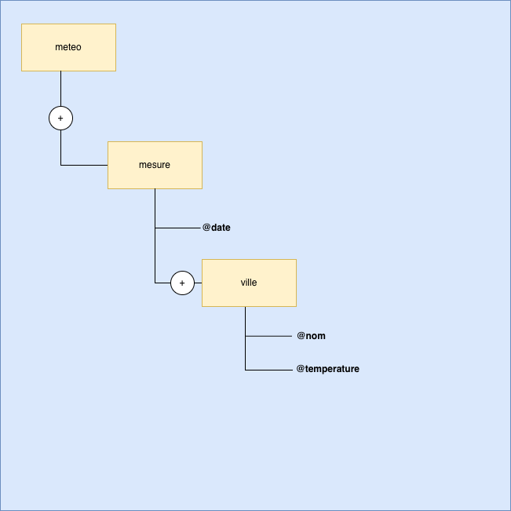
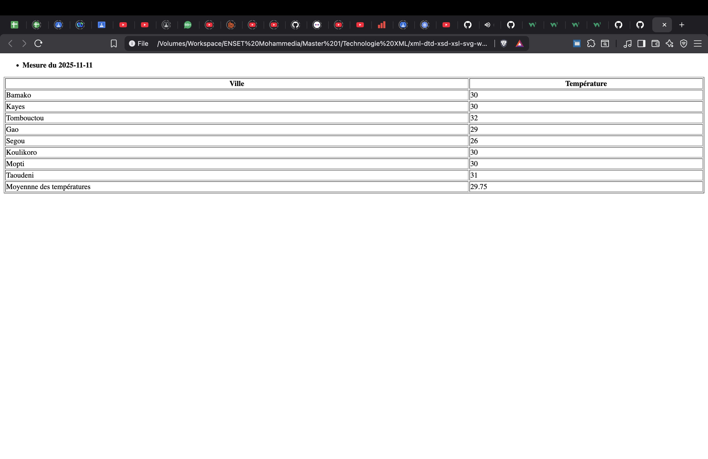
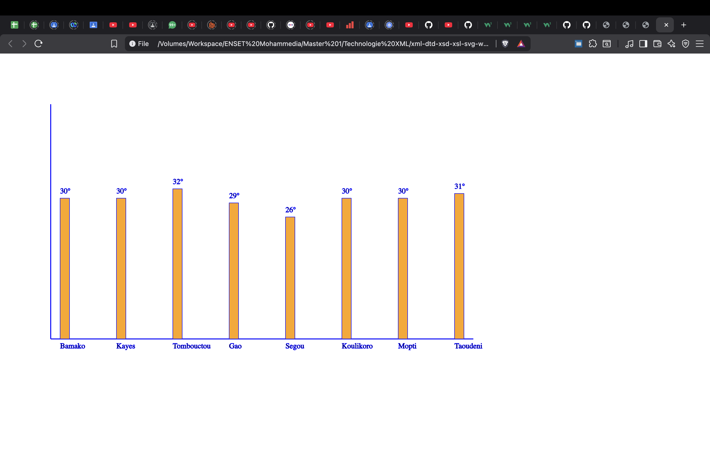

# Weather Project – XML • DTD • XSD • XSL • SVG

This project demonstrates a complete XML workflow built around weather data, including:

- an XML document containing temperature measurements,
- a DTD for basic structural validation,
- an XSD for advanced and strict validation,
- an XSL transformation generating an HTML page,
- an XSL transformation generating an SVG visualization.

---
## Architecture Representation

---
## 1. XML Document: `meteo.xml`

The XML file contains several dated measurements, each listing different cities and their temperatures.  
It is well-formed, validated with the DTD, and fully compliant with the XSD.

---

## 2. DTD Validation: `meteo.dtd`

The DTD defines the basic structure of the document:

- root element `<meteo>`,
- required `<mesure>` elements with a `date` attribute,
- `<ville>` elements with attributes `nom` and `temperature`.

This ensures the minimal structure is respected before performing advanced validation.

---

## 3. XSD Validation: `meteo.xsd`

The XML Schema provides higher-level validation:

- strict data typing,
- value constraints (dates, numeric temperature values),
- simple and complex types,
- structured attribute and element validation.

The XML file fully conforms to this schema.

---

## 4. XSL Transformation to HTML: `meteo.xsl`

This transformation produces an HTML page that displays:

- measurements grouped by date,
- the list of cities and their temperatures.

### HTML Output Preview

---

## 5. XSL Transformation to SVG: `meteo-svg.xsl`

This transformation generates an SVG visualization of the weather data.

### SVG Output Preview

---

## 6. Project Purpose

This project illustrates:

- how to design and structure XML data,
- how to validate documents with DTD and XSD,
- how to use XSLT to generate HTML and SVG output,
- how to build a complete XML → validation → transformation pipeline.

---
